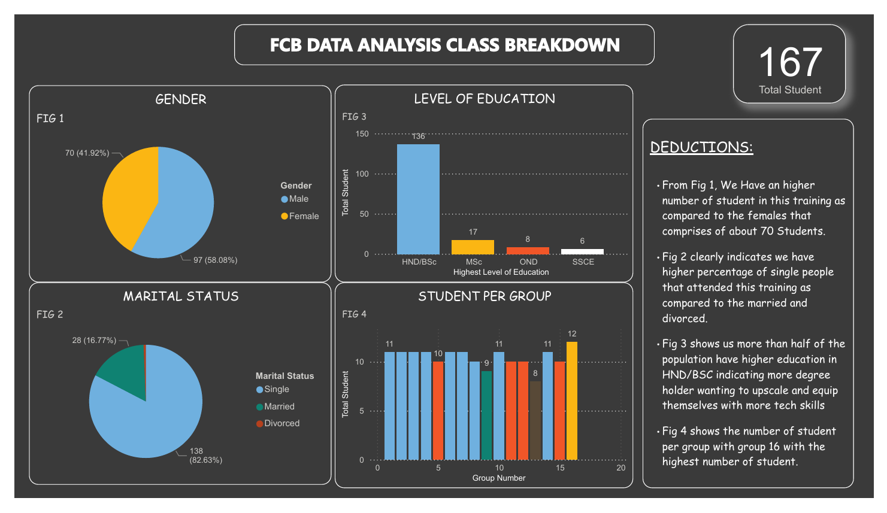

# INCUBATOR-DATA-ANALYSIS-CLASS-REPORT
INCUBATOR DATA ANALYSIS CLASS REPORT
## Project Outline
The primary aim of this project is to conduct a comprehensive analysis of student data from a recent data analyst BootCamp organised by Future Clan. The goal is to gain an insightful understanding of the program's demographics and to uncover any notable trends or patterns related to student backgrounds and participation. By diving deep into this data, I aim to provide valuable insights that can inform future program development, enhance student engagement, and ultimately contribute to the bootcamp's success.

## Project Outline
- Data Sources
- Tools Utilized
- Data Visualization
- Data Analysis
- Key Takeaways
- Conclusion

## Data Source
Google Form  [Download Here](https://docs.google.com/spreadsheets/d/1slHSvA-UtOkseFsfuJJZiOL222vusWt6xEbFOXYxElQ/edit#gid=1248562073)

## Tools Utilized
- Ms Excel for Data Cleaning
- Microsoft Power BI

## Data Visualization

  
