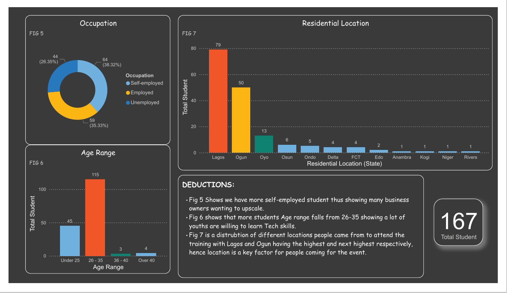

# INCUBATOR-DATA-ANALYSIS-CLASS-REPORT
INCUBATOR DATA ANALYSIS CLASS REPORT
## Project Outline
The primary aim of this project is to conduct a comprehensive analysis of student data from a recent data analyst BootCamp organised by Future Clan. The goal is to gain an insightful understanding of the program's demographics and to uncover any notable trends or patterns related to student backgrounds and participation. By diving deep into this data, I aim to provide valuable insights that can inform future program development, enhance student engagement, and ultimately contribute to the bootcamp's success.

## Project Outline
- Data Sources
- Tools Utilized
- Data Visualization
- Data Analysis/Insight
- Recommendations
- Conclusion

## Data Source
Google Form  [Download Here](https://docs.google.com/spreadsheets/d/1slHSvA-UtOkseFsfuJJZiOL222vusWt6xEbFOXYxElQ/edit#gid=1248562073)

## Tools Utilized
- Ms Excel for Data Cleaning
- Microsoft Power BI

## Data Visualization

## Data Analysis/Insight

**Class Composition**

Our analysis began with a basic overview of the class composition. The boot camp hosted a total of 167 participants. This number provided a solid sample size to extract meaningful insights.

**Age Distribution**

A significant finding was that the majority of the participants fell within the 26 to 35 age range. This group, comprising 115 individuals, was twice as large as all other age groups combined. This concentration suggested that the boot camp particularly appeals to young professionals, possibly those seeking career advancement or a change in profession.

**Gender Breakdown**

Gender analysis revealed that males constituted 58.08% of the participants. While this indicates a male majority, it also highlights an opportunity to increase female participation, promoting gender diversity in the field of data analytics.

**Group**

Interestingly, Group 16 has the highest number of students, this indicating that it was randomly done.

**Educational Background**

When examining educational qualifications, participants with HND/BSc degrees showed the highest response rate at 81.44%. This high engagement level suggests that individuals with higher education backgrounds are more likely to participate actively in such programs, possibly due to a stronger alignment of the boot camp’s content with their career goals.

**Occupational Levels**

The survey also revealed that 38.32% of the respondents were self-employed. This significant proportion indicates a strong interest among self-employed individuals in acquiring data analytics skills, possibly to enhance their business operations or offer data-driven services.

**Marital Status**

Finally, marital status data showed that 82.63% of the respondents were single. This demographic detail might suggest that single individuals have more flexibility and time to invest in intensive learning programs like bootcamps.

## Recommendations
- Marketing Campaigns: Launch targeted marketing campaigns focusing on the identified age group and gender demographics. Use data-driven insights to craft compelling messages.
- Curriculum Development: Enhance the curriculum with advanced modules for HND/BSc holders and business-oriented content for self-employed participants.
- Flexibility in Learning: Provide flexible learning options and extensive online resources to cater to single participants and those with varying schedules.
- Diversity Initiatives: Implement outreach programs and partnerships to attract a broader and more diverse participant base.

  ## Conclusion
  
To boost the bootcamp's effectiveness, I will recommend targeting marketing efforts at the 26-35 age group, encouraging more female participation. Developing advanced and business-focused content, along with flexible learning options, will further enhance the program. Broadening demographic outreach will improve engagement and inclusivity.

These steps will better meet participant needs, create a diverse learning environment, and drive the boot camp's success.
